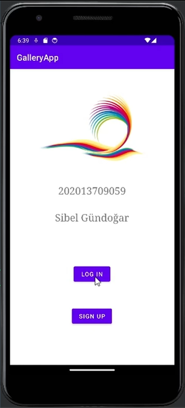
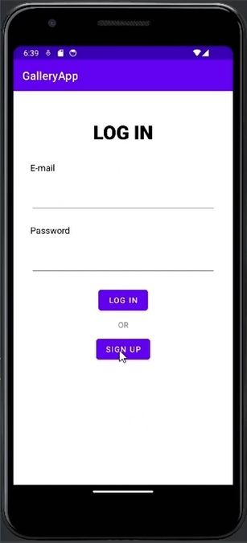
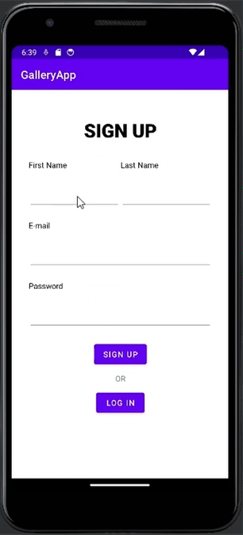
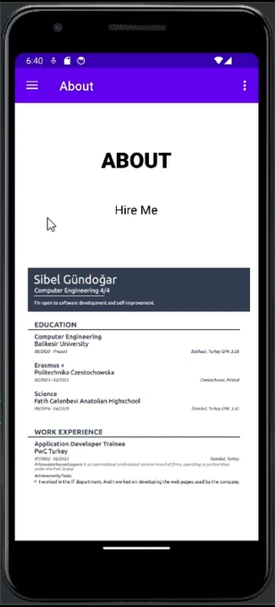
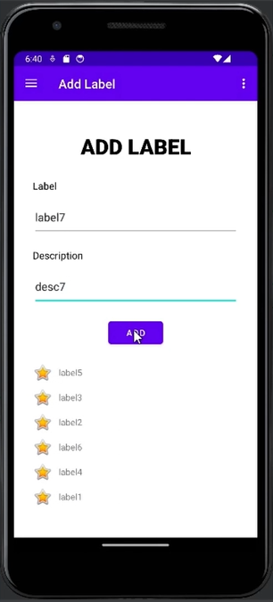
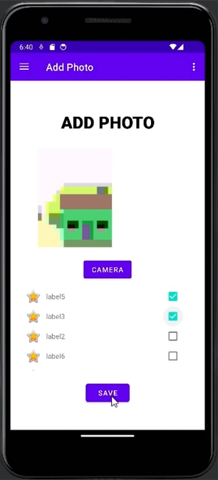
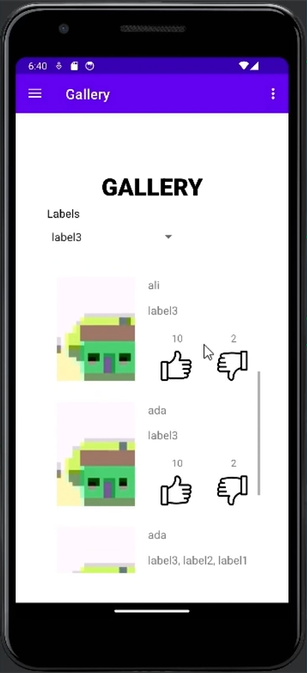
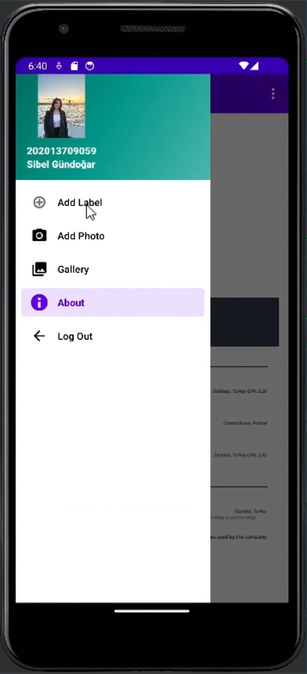

# Project Title
GalleryApp - Social Media Mobile Application

## Description
The application initially opens with a splash screen. After that, you can either log in or sign up to proceed to the about page. On the label page, you can add labels. Then, on the photo page, you can take a photo with the camera, select labels from the label list, and share the photo tagged with these labels. The shared photos can be seen on the gallery page, where all users' posts, along with the labels and the information of the person who shared them, are displayed. 
### Youtube Video
If you want to see how the application works, you can find it at the following YouTube link:
https://www.youtube.com/watch?v=CVJV3dF9Yd0

### Screenshots of the application

.

